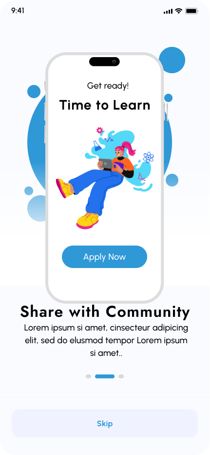
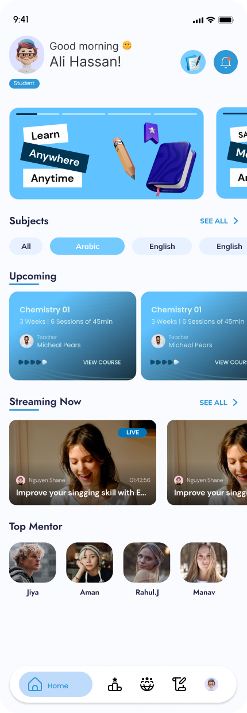
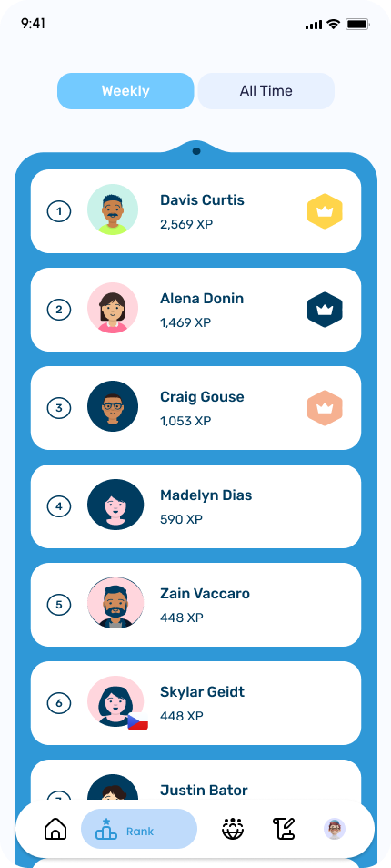
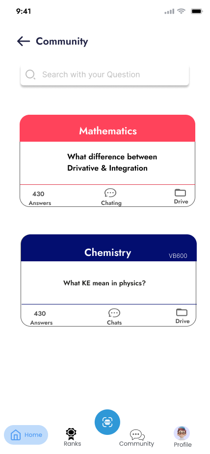
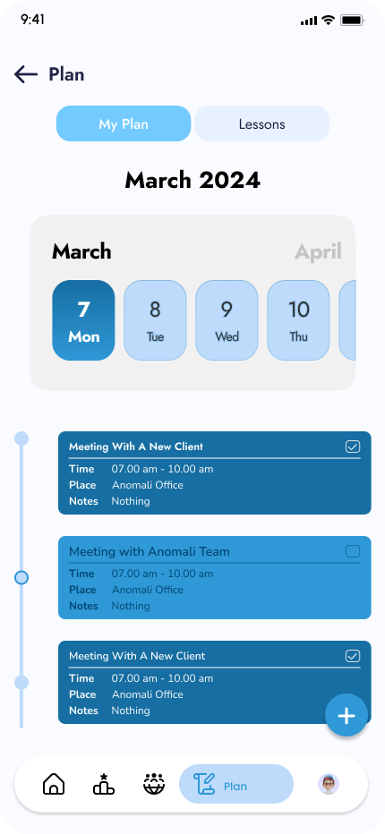
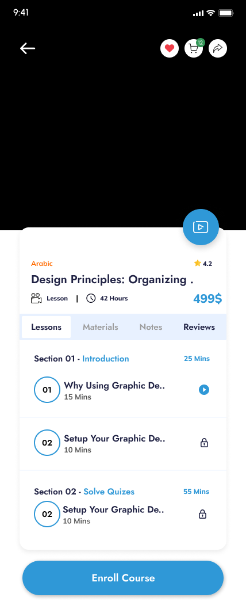
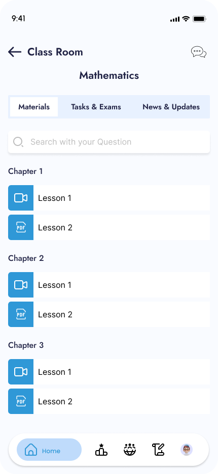
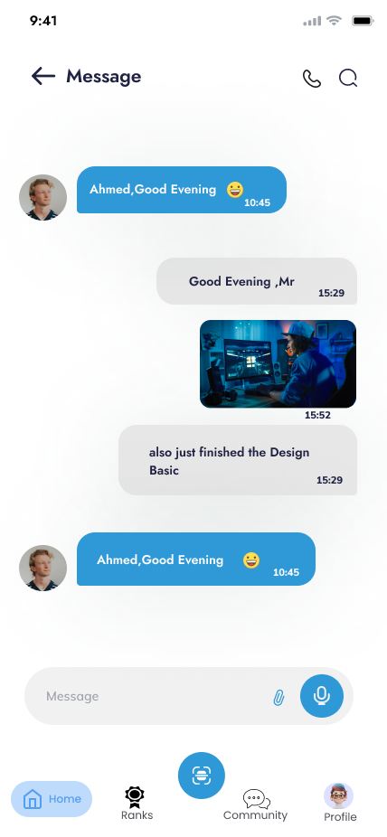

# 📚 EOL App

تطبيق EOL هو منصة تعليمية تفاعلية تهدف إلى تسهيل عملية التعلم للطلاب من خلال محتوى منظم، اختبارات، تواصل مباشر، والكثير من الميزات الذكية.

---

## 📸 Screenshots

إليك بعض صور التطبيق من الداخل:

### المجموعة الأولى: تجربة البداية
| Onboarding | Authentication |
|------------|----------------|
|  |  |

### المجموعة الثانية: الشاشات الرئيسية
| Home | Rank | Community | Plan |
|------|------|-----------|------|
|  |  |  |  |

### المجموعة الثالثة: صفحات المحتوى والتعلم
| Course | Class Room | Class Room
|--------|-----------|-----------|
|  |  |  | 

### المجموعة الرابعة: الملفات الشخصية
| Student Profile | Teacher Profile |
|----------------|-----------------|
|  |  |


---

## 🚀 المميزات

- تسجيل دخول الطلاب والمعلمين كلٌ بواجهة خاصة.
- كورسات تعليمية مرتبة حسب المستوى.
- اختبارات تفاعلية ونتائج فورية.
- محادثة بين الطلاب + بوت ذكي لفهم الملفات الدراسية.
- نظام نقاط XP وتحفيز من خلال الترتيب.
- تحميل ومشاهدة فيديوهات تعليمية.
- قسم أسئلة وأجوبة تفاعلي بين الطلاب.
- نظام اشتراكات للطلاب ودخل للمعلمين.
- واجهة سهلة وسلسة تدعم العربية والإنجليزية.

---

## 🛠️ التقنيات المستخدمة

- Flutter
- Firebase
- Bloc / Cubit
- Lottie
- Google Sign-In & Facebook Auth
- Local & Cloud Storage
- Clean Architecture

---

## 📦 تركيب المشروع

```bash
git clone https://github.com/your-username/eol-app.git
cd eol-app
flutter pub get
flutter run
```

---

## 🧑‍💻 المطور

- 👨‍💻 Mohamed Ahmed Mohamed Abdelkawy  
- 📧 mohamed@example.com  
- 💼 [LinkedIn](https://www.linkedin.com/in/yourprofile) | [GitHub](https://github.com/your-username)
